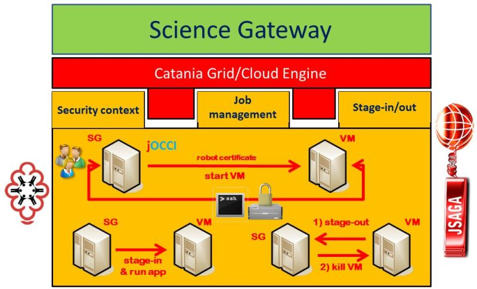

************************************
JSAGA ADAPTOR FOR JOCCI-BASED CLOUDS 
************************************

============
About
============

-------------

.. _1: https://www.ogf.org
.. _2: http://software.in2p3.fr/jsaga/latest-release/
.. _3: http://occi-wg.org/
.. _CHAIN_REDS: https://www.chain-project.eu/
.. _CESNET: http://www.cesnet.cz/

The Simple API for Grid Applications (SAGA) is a family of related standards specified by the Open Grid Forum [1_] to define an application programming interface (API) for common distributed computing functionality.

These APIs does not strive to replace Globus or similar grid computing middleware systems, and does not target middleware developers, but application developers with no background on grid computing. Such developers typically wish to devote their time to their own goals and minimize the time spent coding infrastructure functionality. The API insulates application developers from middleware.

The specification of services, and the protocols to interact with them, is out of the scope of SAGA. Rather, the API seeks to hide the detail of any service infrastructures that may or may not be used to implement the functionality that the application developer needs. The API aligns, however, with all middleware standards within Open Grid Forum (OGF).

JSAGA [2_] is a Java implementation of the Simple API for Grid Applications (SAGA) specification from the Open Grid Forum (OGF) [1_]. It permits seamless data and execution management between heterogeneous grid infrastructures.

The current stable release is available at:

- http://software.in2p3.fr/jsaga/

The current development SNAPSHOT is available at:

- http://software.in2p3.fr/jsaga/dev/

Using the jOCCI APIs developed by CESNET_, the adaptor takes care of: 

(i) switching-on the VM pre-installed with the required application, 
(ii) establishing a secure connection to it signed using a digital “robot” certificate, 
(iii) staging the input file(s) in the VM, 
(iv) executing the application, 
(v) retrieving the output file(s) at the end of the computation and
(vi) killing the VM.

The high-level architecture of the JSAGA adaptor for OCCI-complaint cloud middleware is shown in the below figure:

============
Installation
============

- Using Maven: 

.. code:: xml

   <dependencies>
        <dependency>
            <groupId>fr.in2p3.jsaga.adaptor</groupId>
            <artifactId>jsaga-adaptor-ssh3</artifactId>
            <version>1.2.0-SNAPSHOT</version>
           <scope>compile</scope>
        </dependency>
        <dependency>
            <groupId>fr.in2p3.jsaga.adaptor</groupId>
            <artifactId>jsaga-adaptor-voms</artifactId>
            <version>1.2.0-SNAPSHOT</version>
            <scope>compile</scope>
        </dependency>
        <dependency>
            <groupId>fr.in2p3.jsaga</groupId>
            <artifactId>jsaga-engine</artifactId>
            <version>1.2.0-SNAPSHOT</version>
            <scope>compile</scope>
        </dependency>
        <dependency>
            <groupId>commons-net</groupId>
            <artifactId>commons-net</artifactId>
            <version>3.3</version>
        </dependency>
        <dependency>
            <groupId>org.slf4j</groupId>
            <artifactId>slf4j-jdk14</artifactId>
            <version>1.7.12</version>
        </dependency>
        <dependency>
            <groupId>cz.cesnet.cloud</groupId>
            <artifactId>jocci-api</artifactId>
            <version>0.2.0</version>
        </dependency>
    </dependencies>
    <repositories>
       <repository>
           <id>CC-IN2P3 maven repository</id>
           <url>http://maven.in2p3.fr/</url>
       </repository>
    </repositories>

============
Usage
============

- Configure the security context for testing the new JSAGA Adaptor:

.. code:: bash

   ]$ cat jsaga-adaptor-jocci/test/resources/etc/jsaga-default-contexts.xml
   <?xml version="1.0" encoding="UTF-8"?>
   <jsaga-default xmlns="http://www.in2p3.fr/jsaga/session">
       <contexts>
            <context type="jocci">
               <attribute name="UserProxy" value="${user.home}/.jsaga/contexts/jOCCI/proxy"/>
               <attribute name="CertRepository" value="/etc/grid-security/certificates/"/>
               <attribute name="VomsDir" value="/etc/grid-security/vomsdir/"/>
               <attribute name="UserID" value="root"/>
               <attribute name="UserPrivateKey" value="${user.home}/.ssh/id_rsa"/>
               <attribute name="UserPublicKey" value="${user.home}/.ssh/id_rsa.pub"/>
               <data type="jocci"/>
               <job type="jocci">
                   <attribute name="attributes_title" value="jOCCI-VM"/>
                   <attribute name="mixin_os_tpl" value="uuid_chain_reds_generic_vm_fedcloud_dukan_100"/>
                   <attribute name="mixin_resource_tpl" value="small"/>
                   <attribute name="credentials_publickey" value="true"/>
                   <attribute name="credentials_publickey_name" value="root"/>
               </job>
            </context>
       </contexts>
    <session>
        <context type="jocci"/>
    </session>
  </jsaga-default>

- Create a RFC proxy certificate for your given VO:

.. code:: bash

   ]$ voms-proxy-init --voms vo.chain-project.eu -rfc
   Enter GRID pass phrase for this identity:
   Contacting voms.ct.infn.it:15011
   [/C=IT/O=INFN/OU=Host/L=Catania/CN=voms.ct.infn.it] "vo.chain-project.eu".
   Remote VOMS server contacted succesfully.

   Created proxy in /tmp/x509up_u501.
   Your proxy is valid until Wed Jun 03 22:38:16 CEST 2015

   ]$ cp /tmp/x509up_u501 ${user.home}/.jsaga/contexts/jOCCI/proxy

- Create the service URL and some additional settings for testing the JSAGA Adaptor:

.. code:: bash

 ]$ mkdir -p ${HOME}/.jsaga/context/jOCCI
 ]$ cd ${HOME}/.jsaga
 
 ]$ cat saga-test.properties 
 jocci.jobservice.url=
        jocci://carach5.ics.muni.cz:11443/?attributes_title=jOCCI-VM&\
        mixin_os_tpl=uuid_chain_reds_generic_vm_fedcloud_dukan_100&\
        mixin_resource_tpl=small&credentials_publickey=true&credentials_publickey_name=root

- Testing are classified in differents sets:

   * jOCCIJobDescriptionTest: tests if SAGA attributes are supported. Do not submit any jobs
   * jOCCIJobRunMinimalTest: submit a very simple job "/bin/date" and checks that status is OK
   * jOCCIJobRunRequiredTest: test the CANCEL and the FAILED status       
   * jOCCIJobRunOptionalTest: test SUSPEND/RESUME
   * jOCCIJobRunSandboxTest: test jobs with input and/or output sandbox
   * jOCCIJobRunInfoTest: test retrieving of job info (dates, hosts, exit code...)
   * jOCCIJobRunInteractiveTest: submit an interactive job

.. code:: bash

 ]$ cd jsaga-adaptor-jocci
 ]$ mvn integration-test '-Dtest=integration.jOCCIExecutionTestSuite$jOCCIJobRunMinimalTest'
 [INFO] Scanning for projects...
 [WARNING] 
 [WARNING] Some problems were encountered while building the effective model for 
 [WARNING] fr.in2p3.jsaga.adaptor:jsaga-adaptor-jocci:jar:1.2.0-SNAPSHOT
 [WARNING] Detected profiles.xml alongside fr.in2p3.jsaga.adaptor:jsaga-adaptor-jocci:1.2.0-SNAPSHOT, 
 [WARNING] this file is no longer supported and was ignored, please use the settings.xml instead
 [WARNING] 
 [WARNING] It is highly recommended to fix these problems because they threaten the stability of your build.
 [WARNING] 
 [WARNING] For this reason, future Maven versions might no longer support building such malformed projects.
 [WARNING] 
 [INFO] 
 [INFO] Using the builder org.apache.maven.lifecycle.internal.builder.singlethreaded.SingleThreadedBuilder 
 [INFO] with a thread count of 1
 [INFO]                                                                         
 [INFO] ------------------------------------------------------------------------
 [INFO] Building Adaptors for jOCCI 1.2.0-SNAPSHOT
 [INFO] ------------------------------------------------------------------------
 [WARNING] The POM for castor:castor:jar:xml:1.0 is missing, no dependency information available
 [INFO] 
 [INFO] --- xslt-maven-plugin:1.0:transform (default) @ jsaga-adaptor-jocci ---
 [INFO] # of XML files: 1
 [INFO] transform, 
 srcFile: /home/larocca/jsaga/adaptors/jsaga-adaptor-jocci/test/resources/etc/jsaga-default-contexts.xml, 
 destFile: /home/larocca/jsaga/adaptors/jsaga-adaptor-jocci/build/generated-site/xdoc/example.xml
 [INFO] 
 [INFO] 
 [INFO] --- maven-resources-plugin:2.6:resources (default-resources) @ jsaga-adaptor-jocci ---
 [INFO] Using 'ISO-8859-1' encoding to copy filtered resources.
 [INFO] Copying 1 resource
 [INFO] 
 [INFO] --- maven-compiler-plugin:3.1:compile (default-compile) @ jsaga-adaptor-jocci ---
 [INFO] Nothing to compile - all classes are up to date
 [INFO] 
 [INFO] --- maven-resources-plugin:2.6:testResources (default-testResources) @ jsaga-adaptor-jocci ---
 [INFO] Using 'ISO-8859-1' encoding to copy filtered resources.
 [INFO] Copying 3 resources
 [INFO] 
 [INFO] --- maven-compiler-plugin:3.1:testCompile (default-testCompile) @ jsaga-adaptor-jocci ---
 [INFO] Nothing to compile - all classes are up to date
 [INFO] 
 [INFO] --- maven-surefire-plugin:2.16:test (default-test) @ jsaga-adaptor-jocci ---
 [INFO] Surefire report directory: /home/larocca/jsaga/adaptors/jsaga-adaptor-jocci/build/surefire-reports

 -------------------------------------------------------
  T E S T S
 -------------------------------------------------------
 Running integration.jOCCIExecutionTestSuite$jOCCIJobRunMinimalTest
 INFO integration.jOCCIExecutionTestSuite$jOCCIJobRunMinimalTest: test_run running...
 INFO it.infn.ct.jsaga.adaptor.jocci.job.jOCCIJobControlAdaptor: 
 INFO it.infn.ct.jsaga.adaptor.jocci.job.jOCCIJobControlAdaptor: Trying to connect to the cloud host 
                                                                 [ carach5.ics.muni.cz ] 
 INFO it.infn.ct.jsaga.adaptor.jocci.job.jOCCIJobControlAdaptor: 
 INFO it.infn.ct.jsaga.adaptor.jocci.job.jOCCIJobControlAdaptor: See below the details: 
 INFO it.infn.ct.jsaga.adaptor.jocci.job.jOCCIJobControlAdaptor: 
 INFO it.infn.ct.jsaga.adaptor.jocci.job.jOCCIJobControlAdaptor: PREFIX    = 
 INFO it.infn.ct.jsaga.adaptor.jocci.job.jOCCIJobControlAdaptor: ACTION    = create
 INFO it.infn.ct.jsaga.adaptor.jocci.job.jOCCIJobControlAdaptor: RESOURCE  = compute
 INFO it.infn.ct.jsaga.adaptor.jocci.job.jOCCIJobControlAdaptor: 
 INFO it.infn.ct.jsaga.adaptor.jocci.job.jOCCIJobControlAdaptor: AUTH       = x509
 INFO it.infn.ct.jsaga.adaptor.jocci.job.jOCCIJobControlAdaptor: PROXY_PATH = /home/larocca/.jsaga/contexts/jOCCI/proxy
 INFO it.infn.ct.jsaga.adaptor.jocci.job.jOCCIJobControlAdaptor: CA_PATH    = /etc/grid-security/certificates
 INFO it.infn.ct.jsaga.adaptor.jocci.job.jOCCIJobControlAdaptor: 
 INFO it.infn.ct.jsaga.adaptor.jocci.job.jOCCIJobControlAdaptor: HOST        = carach5.ics.muni.cz
 INFO it.infn.ct.jsaga.adaptor.jocci.job.jOCCIJobControlAdaptor: PORT        = 11443
 INFO it.infn.ct.jsaga.adaptor.jocci.job.jOCCIJobControlAdaptor: ENDPOINT    = https://carach5.ics.muni.cz:11443/
 INFO it.infn.ct.jsaga.adaptor.jocci.job.jOCCIJobControlAdaptor: PUBLIC KEY  = /home/larocca/.ssh/id_rsa.pub
 INFO it.infn.ct.jsaga.adaptor.jocci.job.jOCCIJobControlAdaptor: PRIVATE KEY = /home/larocca/.ssh/id_rsa
 INFO it.infn.ct.jsaga.adaptor.jocci.job.jOCCIJobControlAdaptor: 
 INFO it.infn.ct.jsaga.adaptor.jocci.job.jOCCIJobControlAdaptor: Creating a new resource using jOCCI-api. Please wait!
 INFO it.infn.ct.jsaga.adaptor.jocci.job.jOCCIJobControlAdaptor: VM Title     = jOCCI-VM
 INFO it.infn.ct.jsaga.adaptor.jocci.job.jOCCIJobControlAdaptor: OS           = uuid_chain_reds_generic_vm_fedcloud_dukan_100
 INFO it.infn.ct.jsaga.adaptor.jocci.job.jOCCIJobControlAdaptor: Flavour      = small
 INFO it.infn.ct.jsaga.adaptor.jocci.job.jOCCIJobControlAdaptor: 
 INFO it.infn.ct.jsaga.adaptor.jocci.job.jOCCIJobControlAdaptor: [ TEMPLATE ]
 INFO it.infn.ct.jsaga.adaptor.jocci.job.jOCCIJobControlAdaptor: - Available os template mixins ...
 INFO it.infn.ct.jsaga.adaptor.jocci.job.jOCCIJobControlAdaptor: 

 Category{term=uuid_chain_reds_aleph2000_fedcloud_dukan_105, 
 scheme=http://occi.carach5.ics.muni.cz/occi/infrastructure/os_tpl#, 
 title=CHAIN-REDS-ALEPH2000@fedcloud-dukan, 
 location=/mixin/os_tpl/uuid_chain_reds_aleph2000_fedcloud_dukan_105/, attributes=SetCover{[]}}
 
 INFO it.infn.ct.jsaga.adaptor.jocci.job.jOCCIJobControlAdaptor: 
 Category{term=uuid_chain_reds_wrf_fedcloud_dukan_103, 
 scheme=http://occi.carach5.ics.muni.cz/occi/infrastructure/os_tpl#, 
 title=CHAIN-REDS-WRF@fedcloud-dukan, 
 location=/mixin/os_tpl/uuid_chain_reds_wrf_fedcloud_dukan_103/, attributes=SetCover{[]}}
 
 INFO it.infn.ct.jsaga.adaptor.jocci.job.jOCCIJobControlAdaptor: 
 Category{term=uuid_chain_reds_generic_www_fedcloud_dukan_110, 
 scheme=http://occi.carach5.ics.muni.cz/occi/infrastructure/os_tpl#, 
 title=CHAIN-REDS-Generic-WWW@fedcloud-dukan, 
 location=/mixin/os_tpl/uuid_chain_reds_generic_www_fedcloud_dukan_110/, 
 attributes=SetCover{[]}}
 
 INFO it.infn.ct.jsaga.adaptor.jocci.job.jOCCIJobControlAdaptor: 
 Category{term=uuid_chain_reds_generic_vm_fedcloud_dukan_100, 
 scheme=http://occi.carach5.ics.muni.cz/occi/infrastructure/os_tpl#, 
 title=CHAIN-REDS-Generic-VM@fedcloud-dukan, 
 location=/mixin/os_tpl/uuid_chain_reds_generic_vm_fedcloud_dukan_100/, 
 attributes=SetCover{[]}}

 INFO it.infn.ct.jsaga.adaptor.jocci.job.jOCCIJobControlAdaptor: 
 Category{term=uuid_chain_reds_tthreader_fedcloud_dukan_104, 
 scheme=http://occi.carach5.ics.muni.cz/occi/infrastructure/os_tpl#, 
 title=CHAIN-REDS-tthreader@fedcloud-dukan, 
 location=/mixin/os_tpl/uuid_chain_reds_tthreader_fedcloud_dukan_104/, 
 attributes=SetCover{[]}}

 INFO it.infn.ct.jsaga.adaptor.jocci.job.jOCCIJobControlAdaptor: 
 Category{term=uuid_chain_reds_octave_fedcloud_dukan_101, 
 scheme=http://occi.carach5.ics.muni.cz/occi/infrastructure/os_tpl#, 
 title=CHAIN-REDS-Octave@fedcloud-dukan, 
 location=/mixin/os_tpl/uuid_chain_reds_octave_fedcloud_dukan_101/, 
 attributes=SetCover{[]}}

 INFO it.infn.ct.jsaga.adaptor.jocci.job.jOCCIJobControlAdaptor: 
 Category{term=uuid_chain_reds_r_fedcloud_dukan_102, 
 scheme=http://occi.carach5.ics.muni.cz/occi/infrastructure/os_tpl#, 
 title=CHAIN-REDS-R@fedcloud-dukan, 
 location=/mixin/os_tpl/uuid_chain_reds_r_fedcloud_dukan_102/, 
 attributes=SetCover{[]}}

 INFO it.infn.ct.jsaga.adaptor.jocci.job.jOCCIJobControlAdaptor: 
 INFO it.infn.ct.jsaga.adaptor.jocci.job.jOCCIJobControlAdaptor: [ CREATE ]
 INFO it.infn.ct.jsaga.adaptor.jocci.job.jOCCIJobControlAdaptor: 

 Category: uuid_chain_reds_generic_vm_fedcloud_dukan_100;
 scheme="http://occi.carach5.ics.muni.cz/occi/infrastructure/os_tpl#";
 class="mixin";title="CHAIN-REDS-Generic-VM@fedcloud-dukan";
 rel="http://schemas.ogf.org/occi/infrastructure#os_tpl";
 location="/mixin/os_tpl/uuid_chain_reds_generic_vm_fedcloud_dukan_100/"
 
 INFO it.infn.ct.jsaga.adaptor.jocci.job.jOCCIJobControlAdaptor: 
 INFO it.infn.ct.jsaga.adaptor.jocci.job.jOCCIJobControlAdaptor: =============== [ R E P O R T ] ===============
 INFO it.infn.ct.jsaga.adaptor.jocci.job.jOCCIJobControlAdaptor: https://carach5.ics.muni.cz:11443/compute/56252
 INFO it.infn.ct.jsaga.adaptor.jocci.job.jOCCIJobControlAdaptor: 
 INFO it.infn.ct.jsaga.adaptor.jocci.job.jOCCIJobControlAdaptor: [ DESCRIPTION ]
 INFO it.infn.ct.jsaga.adaptor.jocci.job.jOCCIJobControlAdaptor: - Getting VM settings
 INFO it.infn.ct.jsaga.adaptor.jocci.job.jOCCIJobControlAdaptor: 

 Category: compute;
           scheme="http://schemas.ogf.org/occi/infrastructure#";
           class="kind"
 Category: uuid_chain_reds_generic_vm_fedcloud_dukan_100;
           scheme="http://occi.carach5.ics.muni.cz/occi/infrastructure/os_tpl#";
           class="mixin"
 Category: compute;
           scheme="http://opennebula.org/occi/infrastructure#";
           class="mixin"
 Category: small;
           scheme="http://schema.fedcloud.egi.eu/occi/infrastructure/resource_tpl#";
           class="mixin"
 Category: user_data;
           scheme="http://schemas.openstack.org/compute/instance#";
           class="mixin"

 X-OCCI-Attribute: occi.compute.cores=1
 X-OCCI-Attribute: occi.compute.memory=2.0
 X-OCCI-Attribute: occi.compute.state="waiting"
 X-OCCI-Attribute: occi.core.id=56252
 X-OCCI-Attribute: occi.core.summary="Instantiated with rOCCI-server on Wed, 29 Jul 2015 14:50:18 +0200."
 X-OCCI-Attribute: occi.core.title="jOCCI-VM"
 X-OCCI-Attribute: org.opennebula.compute.cpu=1.0
 X-OCCI-Attribute: org.opennebula.compute.id=56252
 X-OCCI-Attribute: org.openstack.compute.user_data="I2Nsb3VkLWNvbmZpZwojIHNlZSBodHRwczovL2hlbH[..]wKCg=="
 Link: </network/24>;
  rel="http://schemas.ogf.org/occi/infrastructure#network";
  self="/link/networkinterface/compute_56252_nic_0";
  category="http://schemas.ogf.org/occi/infrastructure#networkinterface 
            http://opennebula.org/occi/infrastructure#networkinterface 
            http://schemas.ogf.org/occi/infrastructure/networkinterface#ipnetworkinterface";
  occi.core.id="compute_56252_nic_0";
  occi.core.source="/compute/56252";
  occi.core.target="/network/24";
  occi.core.title="public";
  occi.networkinterface.address="147.228.242.36";
  occi.networkinterface.interface="eth0";
  occi.networkinterface.mac="02:00:93:e4:f2:24";
  occi.networkinterface.state="inactive";
  org.opennebula.networkinterface.bridge="onebr0";

 Link: </storage/789>;
  rel="http://schemas.ogf.org/occi/infrastructure#storage";
  self="/link/storagelink/compute_56252_disk_0";
  category="http://schemas.ogf.org/occi/infrastructure#storagelink 
            http://opennebula.org/occi/infrastructure#storagelink";
  occi.core.id="compute_56252_disk_0";
  occi.core.source="/compute/56252";
  occi.core.target="/storage/789";
  occi.core.title="74e7eed0-af89-5e74-b7b0-72011db131c6";
  occi.storagelink.deviceid="/dev/vda";
  occi.storagelink.state="inactive";

 INFO it.infn.ct.jsaga.adaptor.jocci.job.jOCCIJobControlAdaptor: 
 INFO it.infn.ct.jsaga.adaptor.jocci.job.jOCCIJobControlAdaptor: Waiting the remote VM finishes the boot!
 INFO it.infn.ct.jsaga.adaptor.jocci.job.jOCCIJobControlAdaptor: Wed 2015.07.29 at 02:48:43 PM CEST
 INFO it.infn.ct.jsaga.adaptor.jocci.job.jOCCIJobControlAdaptor: 
 Waiting [ https://carach5.ics.muni.cz:11443/compute/56252 ] becomes ACTIVE! 

 INFO it.infn.ct.jsaga.adaptor.jocci.job.jOCCIJobControlAdaptor: Starting VM [ 147.228.242.36 ] in progress...
 INFO it.infn.ct.jsaga.adaptor.jocci.job.jOCCIJobControlAdaptor: This operation may take few minutes to complete.
 INFO it.infn.ct.jsaga.adaptor.jocci.job.jOCCIJobControlAdaptor: 
 INFO it.infn.ct.jsaga.adaptor.jocci.job.jOCCIJobControlAdaptor: [ STATUS ] = waiting
 INFO it.infn.ct.jsaga.adaptor.jocci.job.jOCCIJobControlAdaptor: [ STATUS ] = waiting
 INFO it.infn.ct.jsaga.adaptor.jocci.job.jOCCIJobControlAdaptor: [ STATUS ] = inactive
 INFO it.infn.ct.jsaga.adaptor.jocci.job.jOCCIJobControlAdaptor: [ STATUS ] = inactive
 INFO it.infn.ct.jsaga.adaptor.jocci.job.jOCCIJobControlAdaptor: [ STATUS ] = inactive
 INFO it.infn.ct.jsaga.adaptor.jocci.job.jOCCIJobControlAdaptor: [ STATUS ] = active
 INFO it.infn.ct.jsaga.adaptor.jocci.job.jOCCIJobControlAdaptor: 
 INFO it.infn.ct.jsaga.adaptor.jocci.job.jOCCIJobControlAdaptor: 
 Compute [ https://carach5.ics.muni.cz:11443/compute/56252 ] is active.
 INFO it.infn.ct.jsaga.adaptor.jocci.job.jOCCIJobControlAdaptor: IP address = 147.228.242.36
 INFO it.infn.ct.jsaga.adaptor.jocci.job.jOCCIJobControlAdaptor: Checking for connectivity. Please wait! 
 INFO it.infn.ct.jsaga.adaptor.jocci.job.jOCCIJobControlAdaptor: SSH daemon has started [ OK ] 
 INFO it.infn.ct.jsaga.adaptor.jocci.job.jOCCIJobControlAdaptor: Wed 2015.07.29 at 02:50:39 PM CEST
 INFO integration.jOCCIExecutionTestSuite$jOCCIJobRunMinimalTest: 
 [jocci://carach5.ics.muni.cz:11443/?attributes_title=jOCCI-VM&\
  mixin_os_tpl=uuid_chain_reds_generic_vm_fedcloud_dukan_100&\
  mixin_resource_tpl=small]-\
  [38e7bf2c-4f5b-49cb-a001-65218d856db0@147.228.242.36#https://carach5.ics.muni.cz:11443/compute/56252]

 INFO it.infn.ct.jsaga.adaptor.jocci.job.jOCCIJobMonitorAdaptor: 
 INFO it.infn.ct.jsaga.adaptor.jocci.job.jOCCIJobMonitorAdaptor: Calling the getStatus() method
 DEBUG it.infn.ct.jsaga.adaptor.jocci.job.jOCCIJobMonitorAdaptor: State changed to ssh:
 
 Done for job 
 [jocci://carach5.ics.muni.cz:11443/?attributes_title=jOCCI-VM&\
  mixin_os_tpl=uuid_chain_reds_generic_vm_fedcloud_dukan_100&\
  mixin_resource_tpl=small]-\
  [38e7bf2c-4f5b-49cb-a001-65218d856db0@147.228.242.36#https://carach5.ics.muni.cz:11443/compute/56252]
 
 INFO it.infn.ct.jsaga.adaptor.jocci.job.jOCCIJobMonitorAdaptor: Calling the getCreated() method
 INFO it.infn.ct.jsaga.adaptor.jocci.job.jOCCIJobMonitorAdaptor: Calling the getStarted() method
 INFO it.infn.ct.jsaga.adaptor.jocci.job.jOCCIJobMonitorAdaptor: Calling the getFinished() method
 INFO it.infn.ct.jsaga.adaptor.jocci.job.jOCCIJobMonitorAdaptor: Calling the getExitCode() method
 INFO it.infn.ct.jsaga.adaptor.jocci.job.jOCCIJobControlAdaptor: 
 INFO it.infn.ct.jsaga.adaptor.jocci.job.jOCCIJobControlAdaptor: [ STOP & DELETE ]
 INFO it.infn.ct.jsaga.adaptor.jocci.job.jOCCIJobControlAdaptor: - Trigger a 'stop' action to the resource
 INFO it.infn.ct.jsaga.adaptor.jocci.job.jOCCIJobControlAdaptor: Triggered: OK
 INFO it.infn.ct.jsaga.adaptor.jocci.job.jOCCIJobControlAdaptor: - Delete the resource
 INFO it.infn.ct.jsaga.adaptor.jocci.job.jOCCIJobControlAdaptor: Delete: OK
 INFO it.infn.ct.jsaga.adaptor.jocci.job.jOCCIJobControlAdaptor: 
 INFO it.infn.ct.jsaga.adaptor.jocci.job.jOCCIJobControlAdaptor: Stopping the VM [ 147.228.242.36 ]

- Stack trace

.. code:: bash

  ]$ cd build/surefire-reports

============
Contributor(s)
============

Please feel free to contact us any time if you have any questions or comments.

.. _INFN: http://www.ct.infn.it/
.. _CESNET: http://www.cesnet.cz/
.. _IN2P3: http://www.in2p3.fr/

:Authors:

 Roberto BARBERA - Italian National Institute of Nuclear Physics (INFN_),
 
 Michal KIMLE - The National e-Infrastructure for Science, Research, Development and Education in Czech Republic. (CESNET_),
 
 Giuseppe LA ROCCA - Italian National Institute of Nuclear Physics (INFN_),

 Lionel SCHWARZ - Institut National de Physique Nuclear et de Physique des Particules (IN2P3_)
 
